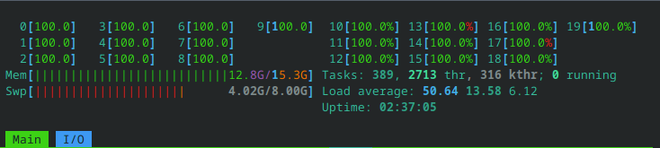
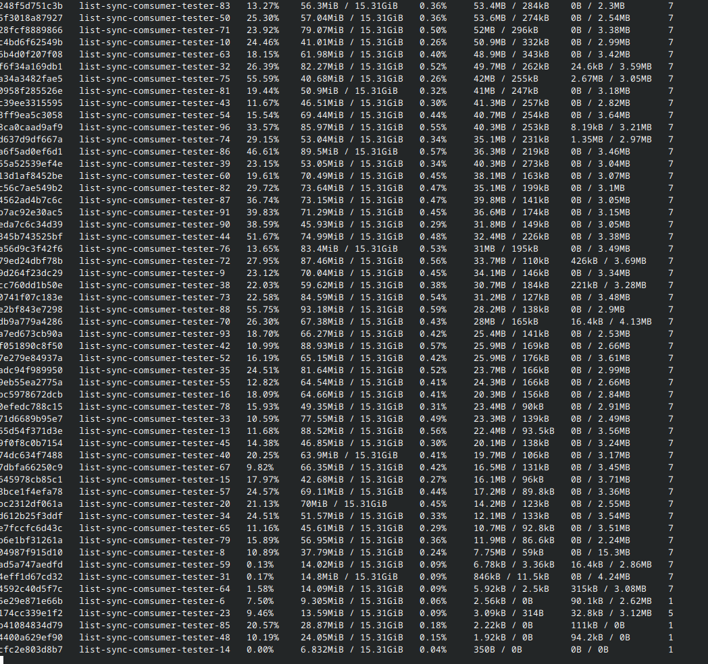
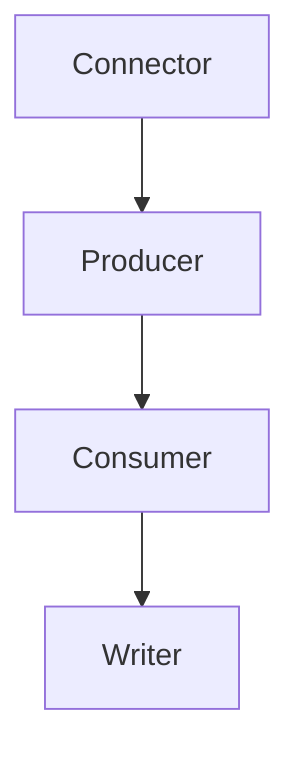

# list_sync

- [Stefano Babini](mailto:stefano.babini@studio.unibo.it)

## Abstract

list_sync is a Python-based system designed for Change Data Capture (CDC) from relational databases to Apache Kafka. It supports both MySQL and PostgreSQL as data sources, providing real-time streaming of database changes through a distributed system architecture while maintaining data consistency and fault tolerance.

## Concept

### Type of Product

- Library

### Use Cases

- Human interaction is primarily through configuration and monitoring
- System runs continuously, capturing database changes in real-time
- Data is stored in Kafka topics and can be consumed ad written to CSV files
- Multiple consumers can process the same data stream independently

## Requirements

### Functional Requirements

1. Capture database changes (inserts, updates, deletes) from MySQL and PostgreSQL
2. Stream changes to Kafka topics in real-time
3. Support multiple concurrent consumers
4. Output changes to CSV files
5. Support both batch processing and real-time streaming
6. The data produced to kafka need to use the same format from both databases
7. Support both databases concurrently

### Non-functional Requirements

1. Performance: Process 1 million rows in under 3 minutes
2. Scalability: Support multiple consumers per topic
3. Reliability: Handle network latency up to 200ms in consumers
4. Throughput: Support 20mbit/s bandwidth limitation

### Implementation Requirements

1. Python 3.12+ for connectors and consumers
2. Docker for containerization and deployment
3. Apache Kafka 3.9.0 for message streaming
4. MySQL with row-based replication
5. PostgreSQL with wal2json for logical replication

# Design

## Architecture

### Event-Driven Architecture

- Chosen for real-time change data capture and streaming requirements
- Enables loose coupling between producers (database connectors) and consumers
- Supports scalability through independent scaling of components
- Facilitates fault tolerance through message persistence and replay

Key benefits:

- Asynchronous processing
- Natural fit for database change events
- Easy scaling of consumers
- Built-in fault tolerance

## Infrastructure

### Components

1.  Database Servers

    - MySQL instance (row-based replication)
    - PostgreSQL instance (logical replication)
    - Each in separate containers

2.  Message Broker Cluster

    - 3 Kafka brokers in separate containers
    - Replication factor: 3
    - Number of partitions: 3

3.  Connectors

    - MySQL connector (CDC)
    - PostgreSQL connector (CDC)
    - Run as separate services

4.  Consumers

    - Multiple instances possible to scale horizontally
    - CSV writers for output

### Network Distribution

#### Docker Network Isolation

- All components run in Docker containers on a dedicated bridge network (`list_sync-net`)
-

#### Component Placement

- All services run on the same physical machine but in isolated containers
- Database servers:
  - MySQL container (`db-mysql`)
  - PostgreSQL container (`db-pgsql`)
- Message brokers:
  - 3 Kafka brokers in separate containers
  - Inter-broker latency simulated up to 10ms (20ms round-trip)
- Connectors:
  - MySQL connector container
  - PostgreSQL connector container
- Consumers:
  - Multiple consumer containers possible
  - Can scale horizontally up to cluster capacity

#### Network Characteristics

- Bandwidth limited to 1000mbit/s between brokers
- Simulated network latency of 20ms between brokers
- All components communicate via Docker bridge network
- Service discovery via static hostnames in Docker DNS

### Service Discovery

- Static host names in Docker network
- Kafka brokers: broker1:9092, broker2:9094, broker3:9095
- MySQL: [db-mysql:3306] db port is exposed on host machine to accsess the database
- PostgreSQL: [db-pgsql:5432] db port is exposed on host machine to accsess the database

## Modelling

### Domain Entities

1.  Connector
    When a row change is detected it fires the row data change to the producer through producer.send_message

        - Continuously fetch changes from the databaes
        - Properties: database, table, kafka_conf

2.  Producer
    Recive the data from the connector and send it to the kafka cluster.
    The undelying librdkafka written in C handles compression and batch processing

        - Send the fetched data to the kafka cluster
        - Properties: topic, kafka_conf

3.  Consumer
    Continuously polls data from the kafka cluster and send to the configured writer through a callback

        - Groups consumers for parallel processing
        - Properties: group ID, topic subscriptions

4.  Writer
    Recive the data from the consumer and write it to file or somwhere else.
    In this project write it to two csv files, one for inserts and the other one for deletes.
    Updates are considered one delete and one insert.

        - Example writer to write the file into csv files
        - Properties: filename, consumer_id, split_files

### Domain Events

1.  Database Events

    - Insert (I)
    - Update (U)
    - Delete (D)

### State Information

- Database table state
- Kafka topic offsets
- Consumer group positions
- Replication slots (PostgreSQL)
- Binary log position (MySQL)

## Interaction

### Communication Patterns

1.  Database to Connector

    - MySQL: Binary log streaming
    - PostgreSQL: Logical replication protocol

2.  Connector to Kafka

    - Asynchronous message production
    - At-least-once delivery
    - Key-based partitioning
    - Compression

3.  Kafka to Consumer

    - Pull-based consumption
    - Batch processing support
    - Commit management

## Behaviour

### Component State Management

1.  Connectors

    - Stateful tracking of replication position
    - Maintains database connections
    - Buffers messages for batch sending

2.  Consumers

    - Stateful offset tracking
    - Handles group coordination

3.  Writers
    - Manages CSV file handles

### State Updates

- Database changes trigger connector events
- Connectors update Kafka topics
- Consumers calls writer to update CSV files
- Consumers Offset commits maintain progress

## Data and Consistency

- **Change Data Capture Events:** Stored in Kafka topics for reliable message persistence and replay.
- **Database State:** The source databases (MySQL and PostgreSQL) maintain the state of the data.
- **Output Files:** CSV files produced by consumers for logging and further processing.
- **Relational Storage:** The primary database tables in MySQL and PostgreSQL ensure ACID properties.
- **Message Queues:** Kafka topics store event streams in a log-based structure, which is ideal for time-ordered event data.  
  This combination is chosen to balance consistency with high throughput and scalability.
- **Data shared between components** Configuration data (e.g., Kafka topics, database credentials) and replication offsets are shared across components (connectors, producers, consumers) to maintain data consistency and processing state across the system.

#### Test storage Implementation

- Relational databases with tables containing:
  - id (BIGINT/BIGSERIAL PRIMARY KEY)
  - category (VARCHAR)
  - domain (VARCHAR)
  - timestamp (TIMESTAMP)
- Indexed on domain column for performance

## Fault-Tolerance

- **Data Replication / Federation / Sharing:**
  - The system uses a 3-node Kafka cluster with a replication factor of 3, ensuring that message data is available even if a broker fails.
  - Database replication modes (row-based for MySQL and logical for PostgreSQL) further support data reliability.
- **Heart-beating, Timeout, and Retry Mechanisms:**

  - **Connectors and Consumers:** Implement retry mechanisms when network issues or transient failures occur.
  - **Producers:** Use automatic retries and acknowledgements to make sure messages are delivered at least once.  
    These mechanisms help maintain continuous operation and allow components to detect and recover from failures.
  - **Connectors** Use broker based commit to keep tracking of the polled data

- **Error Handling:** Each component is designed to log failures and perform clean error handling. For example, consumers commit offsets only after successful processing. If any component fails, the system continues processing with minimal downtime, leveraging Kafka's inherent fault tolerance.

## Availability

- **Caching Mechanism:**  
  Kafka brokers utilize internal caching layers to speed up message retrieval and reduce disk I/O, which supports high throughput and minimizes latency.

- **Load Balancing:**  
  In case of multiple consumers, Consumer groups are used to balance the processing load among multiple instances. This ensures that work is distributed evenly, and no single consumer becomes a bottleneck.

- **Network Partitioning:**  
  In the event of network partitioning, Kafka partitions continue to operate independently. The system is designed to rejoin and reconcile any partitioned data post-recovery, ensuring no data loss and maintaining eventual consistency.

## Security

(needs to be enabled through configuration, it's not enabled by default)

- **Authentication:**  
  Both MySQL and PostgreSQL use password authentication for replication and normal client connections. Kafka brokers can be configured with SASL or SSL for authenticating clients.

- **Authorization:**  
  The system employs role-based access control where access rights are managed based on the user and service roles. Only authenticated components (connectors, producers, consumers) are allowed to interact with databases and Kafka topics.

- **Cryptographic Schemes:**  
  Optional configurations such as SSL/TLS encryption for data in transit and token verification mechanisms can be employed for securing communication between system components.

## Implementation

Key technologies used:

- Python 3.12
- Apache Kafka 3.9.0
- MySQL 8.0 with row-based replication
- PostgreSQL 16 with wal2json
- Docker and Docker Compose
- Traffic control (tc) to simulate latencies inside the docker network

## Validation

Hardware specifications:

```text
H/W path         Device         Class          Description
==========================================================
/0/0                            memory         15GiB System memory
/0/1                            processor      12th Gen Intel(R) Core(TM) i7-1280P
```

Docker lan speed

```
root@a03a74516591:/app# iperf -c tester
------------------------------------------------------------
Client connecting to tester, TCP port 5001
TCP window size: 16.0 KByte (default)
------------------------------------------------------------
[  1] local 172.18.0.2 port 33564 connected with 172.18.0.4 port 5001 (icwnd/mss/irtt=14/1448/127)
[ ID] Interval       Transfer     Bandwidth
[  1] 0.0000-10.0063 sec  79.6 GBytes  68.3 Gbits/sec
```

Test seeding + producing + consuming all data from kafka without network constraints

```
pystream-py3.12[ste@localhost-live]~/Documents/list-sync% docker exec -it list-sync-tester-1 poetry run python test/test_producer_pgsql.py
Retrieving existing IDs
Retrieved existing IDs
Starting to seed the table
Inserted rows: 500566
Updated rows: 249952
Deleted rows: 249482
Time taken to seed the table: 43.06 seconds
..
----------------------------------------------------------------------
Ran 2 tests in 51.310s

OK
```

With network limitations (broker to broker rtt is 20ms)

```
pystream-py3.12[ste@localhost-live]~/Documents/list-sync% ./add_latency_broker.sh
Added bidirectional traffic control to container 403df04fdd98: 1000mbit bandwidth, 10ms latency
Added bidirectional traffic control to container e8a158ea597e: 1000mbit bandwidth, 10ms latency
Added bidirectional traffic control to container 70bccec8718c: 1000mbit bandwidth, 10ms latency
```

```
broker2 to broker1
e7aac33442a3:/$ ping broker1
PING broker1 (172.18.0.50) 56(84) bytes of data.
64 bytes from broker1.list-sync_list_sync-net (172.18.0.50): icmp_seq=1 ttl=64 time=20.2 ms
64 bytes from broker1.list-sync_list_sync-net (172.18.0.50): icmp_seq=2 ttl=64 time=20.4 ms
64 bytes from broker1.list-sync_list_sync-net (172.18.0.50): icmp_seq=3 ttl=64 time=20.3 ms
64 bytes from broker1.list-sync_list_sync-net (172.18.0.50): icmp_seq=4 ttl=64 time=20.2 ms
```

Testing the limited network speed

```
/ # iperf -c broker1
------------------------------------------------------------
Client connecting to broker1, TCP port 5001
TCP window size: 16.0 KByte (default)
------------------------------------------------------------
[  1] local 172.18.0.51 port 41578 connected with 172.18.0.50 port 5001
[ ID] Interval       Transfer     Bandwidth
[  1] 0.00-10.04 sec  1.10 GBytes   941 Mbits/sec
```

Run the test with network speed limited

```
pystream-py3.12[ste@localhost-live]~/Documents/list-sync% docker exec -it list-sync-tester-1 poetry run python test/test_producer_pgsql.py
Retrieving existing IDs
Retrieved existing IDs
Starting to seed the table
Inserted rows: 500048
Updated rows: 250452
Deleted rows: 249500
Time taken to seed the table: 51.78 seconds
..
----------------------------------------------------------------------
Ran 2 tests in 61.426s

OK
```

From now on i will only consume data from kafka brokers, i have already produced 1M row changes
Tests results with 30 consumers (with networks limitations)

```
 *  Executing task: docker logs --tail 1000 -f 3d44bac62b0161b8060ede2388f442080799853364d62ea4595f148b034d91f3

.
----------------------------------------------------------------------
Ran 1 test in 48.480s

OK
```

Tests results with 50 consumers (with networks limitations)

```
Executing task: docker logs --tail 1000 -f 8b9dd9e30a7f4c3d405525881ccb0f7948127ddf9873b5e170e4579775861ee4

.
----------------------------------------------------------------------
Ran 1 test in 64.460s

OK
```

Tests results with 80 consumers (my laptop was at 100% cpus)

```
Executing task: docker logs --tail 1000 -f 8b9dd9e30a7f4c3d405525881ccb0f7948127ddf9873b5e170e4579775861ee4

.
----------------------------------------------------------------------
Ran 1 test in 78.597s

OK
```

Tests results with 100 consumers. Results may not be reliable as my laptop was at its limit with RAM and 100% CPU usage, so performance might be better in real scenarios


```
Executing task: docker logs --tail 1000 -f daf55550c1eed699b106b1523cffe6c5ce786c84d5c95df12d449e0b1a503321

.
----------------------------------------------------------------------
Ran 1 test in 93.535s

OK
```



### Reference values for containers

Performance metrics:

- Consumer memory usage: ~98MB per instance
- Test completion time (without latency): ~136 seconds
- Data seeding time: ~40 seconds
- Similar performance between JSON and Protobuf formats

## Deployment

1. Load network emulation module:

```bash
sudo ./load_module.sh
```

2. Start services:

```bash
docker compose -f brokers.yml -f pgsql.yml -f mysql.yml  up -d
```

3. (Optional) Start consumers:

> Warning! this can cause a lot of disk writing:
> Consumers are configured to not write on disk for now, you can change the command in the respective consumer.yml compose file to enable writing.

```bash
docker compose -f pg-consumers.yml up -d
docker compose -f my-consumers.yml up -d
```

4. Run tests:

```bash
docker compose -f brokers.yml -f pgsql.yml -f mysql.yml -f tester.yml  up -d
docker exec -it list-sync-tester-1 poetry run python test/test_producer_pgsql.py
docker exec -it list-sync-tester-1 poetry run python test/test_producer_mysql.py
```

## User Guide

## Installation

```bash
poetry install
```

## Quick Start

### Connector

```python
from list_sync.connector.base_connector import Connector

# Using default values
default_connector = Connector()
default_connector.connect()

# Using custom configuration
custom_connector = Connector(
    db_type='mysql',
    host='localhost',
    port=3306,
    user='my_user',
    password='my_password',
    database='my_database',
    table='my_table',
    kafka_conf={
        'bootstrap.servers': 'localhost:9092',
        'group.id': 'my-group'
    },
    topic=['my_topic']
)

# Connect to the database
custom_connector.connect()
```

### Consumer Usage

Multiple consumers can be initialized at the same time to pull from the same topic.
If two or more consumers have the same group_id, it is assured that each message will be processed by only one consumer in the group.

```python
from list_sync.consumer import Consumer
from list_sync.consumer.writer import CsvWriter

writer = CsvWriter(filename='./output')
consumer = Consumer(
    callback=writer.write,
    group_id='my_group',
    topic_list=['wal_pg']
)

consumer.consume_messages()
```

## Release

The project is organized into several interdependent modules, each focusing on a specific aspect of the system.

**Module Organization:**

- **Connector Module:**  
  Handles change data capture from relational databases.
- **Producer Functionality:**  
  Embedded within the connector to send data to Kafka.
- **Consumer Module:**  
  Responsible for pulling data from Kafka and triggering the writing process.
- **Writer Module:**  
  Processes consumed messages by writing outputs to CSV files.

These modules are designed to work seamlessly together while still remaining loosely coupled. A simplified dependency graph is shown below:



**Distribution:**

- The modules are packaged together as a single archive. This consolidated approach simplifies dependency management and ensures that all components remain compatible.
- A single archive offers easier installation and guarantees that users have all the necessary modules for a complete setup.

**Versioning:**

- Each release is tagged in the source repository to ensure traceability and consistency.

**Release and Installation:**

- The archive is released onto [PyPI](https://pypi.org/), making it straightforward to install.
- To install the package via pip, simply run:
  ```bash
  pip install list_sync
  ```
- Alternatively, if you are using Poetry, add the package with:
  ```bash
  poetry add list_sync
  ```

This modular design and distribution strategy help keep the project organized, facilitates easy updates, and ensures stable and predictable releases.

## Self-evaluation

### Stefano Babini

#### Strengths

- Successfully implemented change data capture for both MySQL and PostgreSQL
- Achieved performance targets (1M rows < 3 minutes)
- Built scalable consumer architecture
- Comprehensive test coverage with realistic network conditions

#### Weaknesses

- More configuration options could be exposed
- Security features could be enhanced
- Monitoring and observability could be improved
