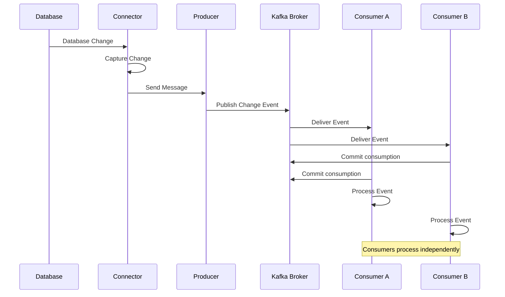
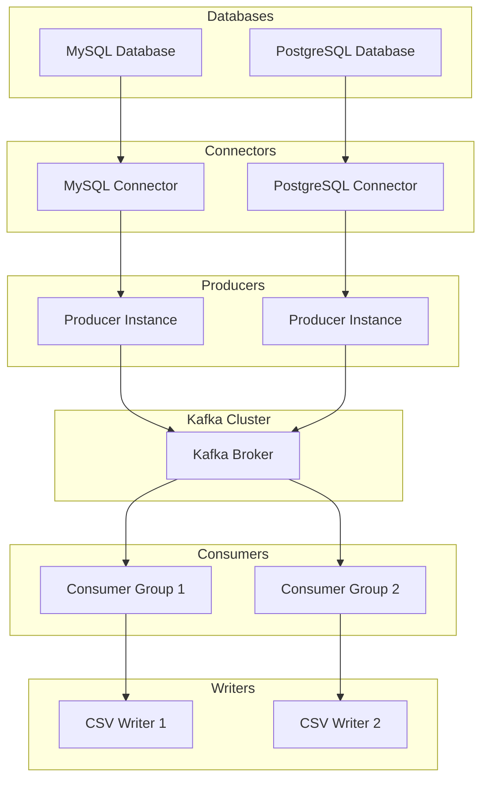
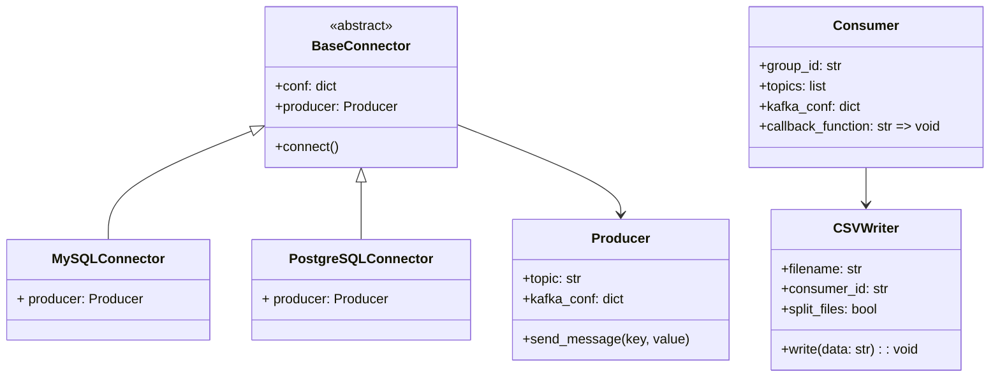
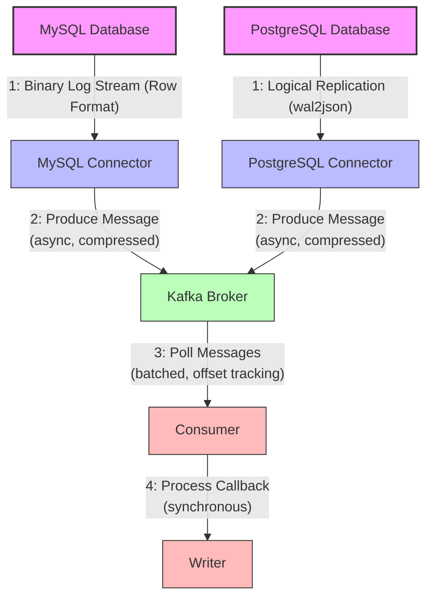
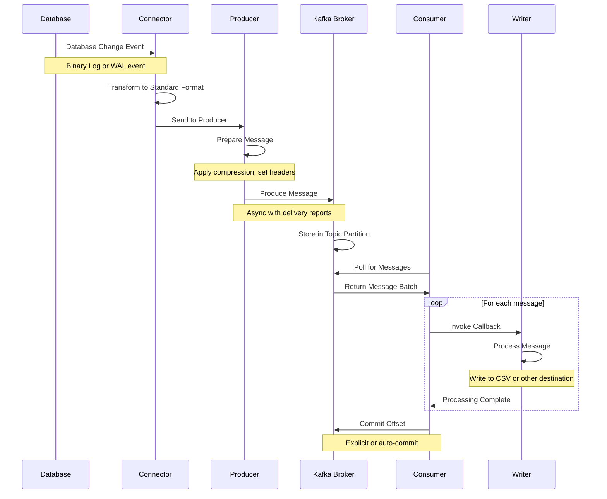

# list_sync

- [Stefano Babini](mailto:stefano.babini@studio.unibo.it)

## Abstract

list_sync is a Python-based system designed for Change Data Capture (CDC) from relational databases to Apache Kafka. It supports both MySQL and PostgreSQL as data sources, providing real-time streaming of database changes through a distributed system architecture while maintaining data consistency and fault tolerance.

## Concept

### Type of Product

- Library

### Use Cases

The system is designed to facilitate human engagement predominantly through configuration management and real-time monitoring operations. It operates in a persistent, uninterrupted mode, employing real-time detection mechanisms to capture incremental modifications within the source database. Captured data streams are persistently stored within Kafka topics, a distributed event streaming platform, which facilitates subsequent consumption and programmatic exportation into CSV formatted files for analytical or archival purposes. The architecture inherently supports concurrent data processing, enabling multiple downstream consumers to independently access and manipulate identical data streams without operational interference, thereby promoting scalable and parallelized workflow integration.
## Requirements

### Functional Requirements

1. Capture database changes (inserts, updates, deletes) from MySQL and PostgreSQL
2. Stream changes to Kafka topics in real-time
3. Support multiple concurrent consumers
4. Output changes to CSV files
5. Support both batch processing and real-time streaming
6. The data produced to kafka need to use the same format from both databases
7. Support both databases concurrently

### Non-functional Requirements

1. Performance: Process 1 million rows in under 3 minutes
2. Scalability: Support multiple consumers per topic
3. Reliability: Handle network latency up to 200ms in consumers
4. Throughput: Support 20mbit/s bandwidth limitation

### Implementation Requirements

1. Python 3.12+ for connectors and consumers
2. Docker for containerization and deployment
3. Apache Kafka 3.9.0 for message streaming
4. MySQL with row-based replication
5. PostgreSQL with wal2json for logical replication

# Design

## Architecture

### Event-Driven Architecture

### Overview

Event-Driven Architecture forms the backbone of the system, providing a robust framework for handling real-time data changes and processing events across distributed components.

- **Chosen for real-time change data capture and streaming requirements**
  - Enables immediate reaction to data changes
  - Supports complex event processing with minimal latency
  - Provides a foundation for real-time analytics and notifications

- **Enables loose coupling between producers (database connectors) and consumers**
  - Producers and consumers have no direct dependencies
  - Components can evolve independently without system-wide impacts
  - New consumers can be added without modifying producers

- **Supports scalability through independent scaling of components**
  - Each producer or consumer can scale based on its own demand
  - Horizontal scaling possible for high-volume event processing
  - Peak loads can be handled through temporary scaling

- **Facilitates fault tolerance through message persistence and replay**
  - Events are persisted in the event broker
  - Consumers can replay events after recovery
  - System can recover from failures with minimal data loss

### Key Benefits

- **Asynchronous processing**
  - Non-blocking operations improve overall system performance
  - Background processing reduces user-facing latency

- **Natural fit for database change events**
  - Direct mapping between database operations and system events
  - Simplified implementation through event streams
  - Historical data changes available through kafka event logs

- **Easy scaling of consumers**
  - Consumer groups allow parallel processing
  - New processing needs accommodated through new consumers
  - Resource allocation optimized per consumer type

- **Built-in fault tolerance**
  - At-least-once delivery guarantees
  - Idempotent consumers handle duplicate events gracefully
  - System resilience during partial outages

### Component Interaction


*This sequence diagram models a real-time change data capture (CDC) architecture employing Apache Kafka for event streaming. The workflow begins with a database emitting state changes, which are intercepted by a dedicated CDC connector. The connector serializes changes into event messages, propagated via a Kafka producer to a centralized broker. Events are persisted in durable Kafka topics, enabling simultaneous distribution to multiple consumer instances (Consumer A and B). Consumers asynchronously process events using isolated offset tracking, committing acknowledgments to the broker post-processing to ensure exactly-once semantics. The decoupled design demonstrates Kafka's capacity to support parallel, fault-tolerant data pipelines, with independent consumer groups processing identical streams for scalable workload distribution.*
### Implementation Considerations

- **Event Schema Management**
  - Does not use shema for flexibility

- **Ordering Guarantees**
  - Partition keys ensure related events maintain order (Based on Table Primary key)

## Infrastructure

### Components

1.  Database Servers

    - MySQL instance (row-based replication)
    - PostgreSQL instance (logical replication)
    - Each in separate containers

2.  Message Broker Cluster

    - 3 Kafka brokers in separate containers
    - Replication factor: 3
    - Number of partitions: 3

3.  Connectors

    - MySQL connector (CDC)
    - PostgreSQL connector (CDC)
    - Run as separate services

4.  Consumers

    - Multiple instances possible to scale horizontally
    - CSV writers for output

### Network Distribution

#### Docker Network Isolation

- All components run in Docker containers on a dedicated bridge network (`list_sync-net`)

#### Component Placement

The system employs a consolidated deployment model where all architectural components reside on a single-node host while maintaining operational isolation through containerization. This configuration comprises two primary relational database management systems (RDBMS): a MySQL instance (db-mysql) and a PostgreSQL instance (db-pgsql), each encapsulated within dedicated containers.

Event streaming functionality is facilitated by a Kafka cluster consisting of three broker instances, each operating in discrete containers to emulate distributed node behavior. Network latency conditions are simulated with a maximum inter-broker delay of 10ms (20ms round-trip time), approximating real-world distributed system characteristics.

Data ingestion pipelines are managed by database-specific connectors separate containers for MySQL and PostgreSQL, responsible for continuous change detection, event serialization, and producer coordination. Downstream consumption capabilities are implemented through horizontally scalable consumer containers, which may be dynamically instantiated up to the host's resource constraints. This elasticity leverages stateless design patterns, enabling parallel processing workloads while maintaining transactional integrity through Kafka's offset management protocols.

The architecture exemplifies a cost-efficient paradigm for prototyping distributed data systems, though it inherently centralizes fault domains due to shared physical infrastructure. Container isolation mitigates resource contention risks while preserving development reproducibility.

#### Network Characteristics

- Bandwidth limited to 1000mbit/s between brokers
- Simulated network latency of 20ms between brokers
- All components communicate via Docker bridge network
- Service discovery via static hostnames in Docker DNS

### Service Discovery

- Static host names in Docker network
- Kafka brokers: broker1:9092, broker2:9094, broker3:9095
- MySQL: [db-mysql:3306] db port is exposed on host machine to accsess the database
- PostgreSQL: [db-pgsql:5432] db port is exposed on host machine to accsess the database

## Modelling

### Domain Entities

1.  **Connector**
    When a row change is detected it fires the row data change to the producer through producer.send_message

        - Continuously fetch changes from the database
        - Properties: database, table, kafka_conf

2.  **Producer**
    Receive the data from the connector and send it to the Kafka cluster.
    The underlying librdkafka written in C handles compression and batch processing

        - Send the fetched data to the kafka cluster
        - Properties: topic, kafka_conf

3.  **Consumer**
    Continuously polls data from the Kafka cluster and send to the configured writer through a callback

        - Groups consumers for parallel processing
        - Properties: group ID, topic subscriptions

4.  **Writer**
    Receive the data from the consumer and write it to file or somewhere else.
    In this project write it to two csv files, one for inserts and the other one for deletes.
    Updates are considered one delete and one insert.

        - Example writer to write the file into csv files
        - Properties: filename, consumer_id, split_files

### Component Diagram


*Component diagram illustrating a scalable data pipeline architecture leveraging Apache Kafka for decoupled communication between heterogeneous data sources (MySQL, PostgreSQL) and downstream consumers. Producers ingest relational data via dedicated connectors, publishing to a Kafka cluster, which enables parallel processing by independent consumer groups (Consumer Group 1, 2) writing outputs to CSV sinks. The design emphasizes modularity, separation of concerns, and horizontal scalability but abstracts operational complexities.*
### Class Diagram


*This class diagram abstracts a producer-consumer pipeline for relational database streaming, prefering inheritance over composition.*
### Domain Events

1.  Database Events

    - Insert (I)
    - Update (U)
    - Delete (D)

### State Information

- Database table state
- Kafka topic offsets
- Consumer group positions
- Replication slots (PostgreSQL)
- Binary log position (MySQL)

## Interaction

### Communication Patterns

1.  Database to Connector

    - MySQL: Binary log streaming
    - PostgreSQL: Logical replication protocol
    - Real-time change data capture (CDC)
    - Transaction-based consistency  

2.  Connector to Kafka

    - Asynchronous message production
    - At-least-once delivery
    - Key-based partitioning
    - Compression

3.  Kafka to Consumer

    - Pull-based consumption
    - Batch processing support
    - Commit management
    - Consumer group balancing
    - Offset management

4.  Consumer to Writer

    - Callback-based processing
    - Synchronous execution

### Communication Flow Details

#### Database to Connector
- **MySQL**: Uses binary log (binlog) with row-based replication format
- **PostgreSQL**: Uses logical decoding with wal2json plugin
- Both provide transactional consistency boundaries
- Each database change is captured with before/after state

#### Connector to Kafka
- Messages include schema, operation type, and row data
- Partitioning based on primary key ensures ordering
- Producers handle temporary broker outages with retry logic
- Compression reduces network bandwidth requirements

#### Kafka to Consumer
- Consumers pull messages in configurable batches
- Offset commits happen after successful processing
- Consumer groups automatically rebalance on failure/scaling
- Consumers manage their position in the event stream

#### Consumer to Writer
- Consumers pass data to writers via callbacks
- Writers handle formatting and storage operations
- CSV Writers separate inserts and deletes into different files

### UML Communication Diagram


*Communication diagram depicting a heterogeneous database ingestion pipeline employing Kafka based event streaming. Source databases (MySQL, PostgreSQL) initiate replication via protocol-specific mechanisms: MySQL's binary log streaming (row-based) and PostgreSQL's logical replication (wal2json output plugin). Dedicated connectors serialize and asynchronously propagate change events to Kafka brokers using compressed message batches (stages 1-2). Consumers implement batched message polling with explicit offset tracking to enforce exactly-once delivery semantics (stage 3), triggering synchronous processing callbacks that interface with downstream persistence layers (stage 4). Containerized components demonstrate separation of concerns between database protocol adaptation, message routing, and stateful write operations. Color coding denotes functional roles: magenta (data sources), blue (protocol adapters), green (messaging infrastructure), and red (processing units). The architecture exemplifies a pattern for reconciling polyglot database systems into unified streaming pipelines while preserving transactional ordering within each database domain.*
### Detailed Message Flow Sequence


*Sequence diagram modeling a Kafka centric change data capture pipeline for heterogeneous database synchronization. The workflow initiates with database engines (MySQL/PostgreSQL) emitting low-level storage events via native mechanisms (binary log or WAL), which are captured by protocol-specific connectors. Connectors normalize events into a canonical format before asynchronous transmission to Kafka producers, which apply message compression and metadata enrichment prior to broker submission (observing non-blocking delivery semantics with confirmation callbacks). Consumers employ batched message retrieval with explicit offset management, triggering synchronous processing callbacks that interface with persistence layers (e.g., CSV writers).*
## Behaviour

### Component State Management

1.  **Connectors**

    - Stateful tracking of replication position
      - MySQL: Tracks binlog filename and position
      - PostgreSQL: Maintains LSN (Log Sequence Number) position
      - Persists position information to survive restarts
    - Does not handle schema changes unless connector restart

2.  **Producers**
    - Handles partitioning strategy
      - Consistent hashing on primary keys
      - Custom partitioning for special cases
      - Partition balancing for even distribution

3.  **Consumers**

    - Stateful offset tracking
      - Persists consumed offsets in Kafka
      - Exactly-once semantics through transactional consumers
    - Handles group coordination
      - Participates in consumer group rebalancing
      - Implements graceful join/leave procedures
      - Manages partition assignment strategy
    - Manages processing state
      - Implements ordered processing within partitions

4.  **Writers**
    - Manages CSV file handles
      - Opens/closes files based on activity

### State Updates

- Database changes trigger connector events
  - Row-level changes captured from transaction logs
  - Changes include operation type (INSERT/UPDATE/DELETE)
  - Before/after image of affected rows provided
- Producers update Kafka topics
  - Events serialized in a standardized format
  - Headers include metadata (source DB, table, timestamp)
  - Payload contains row data in JSON
  - Events partitioned by primary key for ordering
- Consumers call writer to update CSV files
  - Transformation of Kafka messages to CSV format
  - Separate files for different operations (insert/delete)
  - Updates treated as delete+insert pair
- Consumer offset commits maintain progress
  - Commits occur after successful processing
  - Exactly-once semantics through atomic operations
  - Restart from last committed position after failure

### Error Handling and Recovery

- **Connector Failures**
  - Automatic reconnection to database
  - Resume from last known position

- **Broker Connectivity Issues**
  - Producer buffering during temporary outages

- **Consumer Processing Errors**
  - Configurable retry policies
  - Manual intervention options for unrecoverable errors

### System Lifecycle Management

- **Startup Sequence**
  - Components start in dependency order
  - State restoration from persistent storage
  - Initialization health checks
  - Warm-up period to achieve steady state

- **Scaling Operations**
  - Consumer group rebalancing
  - Producer connection pooling
  - Zero-downtime scaling procedures
  - Load distribution strategies

### Performance Considerations

- **Batching Optimizations**
  - Message batching in producers
  - Batch consumption in consumers
  - Bulk writes to target systems
  - Configurable batch sizes based on workload

- **Resource Management**
  - Memory utilization monitoring
  - Thread pool management
  - Connection pooling
  - File descriptor usage optimization

- **Throughput vs. Latency Tuning**
  - Configurable trade-offs for different use cases
  - Latency-sensitive vs. throughput-oriented profiles
  - Monitoring of SLAs (Service Level Agreements) and performance metrics
  - Adaptive tuning based on system load

## Data and Consistency

- **Change Data Capture Events:** Stored in Kafka topics for reliable message persistence and replay.
- **Database State:** The source databases (MySQL and PostgreSQL) maintain the state of the data.
- **Output Files:** CSV files produced by consumers for logging and further processing.
- **Relational Storage:** The primary database tables in MySQL and PostgreSQL ensure ACID properties.
- **Message Queues:** Kafka topics store event streams in a log-based structure, which is ideal for time-ordered event data.  
  This combination is chosen to balance consistency with high throughput and scalability.
- **Data shared between components** Configuration data (e.g., Kafka topics, database credentials) and replication offsets are shared across components (connectors, producers, consumers) to maintain data consistency and processing state across the system.

#### Test storage Implementation

- Relational databases with tables containing:
  - id (BIGINT/BIGSERIAL PRIMARY KEY)
  - category (VARCHAR)
  - domain (VARCHAR)
  - timestamp (TIMESTAMP)
- Indexed on domain column for performance

## Fault-Tolerance

- **Data Replication / Federation / Sharing:**
  - The system uses a 3-node Kafka cluster with a replication factor of 3, ensuring that message data is available even if a broker fails.
  - Database replication modes (row-based for MySQL and logical for PostgreSQL) further support data reliability.
- **Heart-beating, Timeout, and Retry Mechanisms:**

  - **Connectors and Consumers:** Implement retry mechanisms when network issues or transient failures occur.
  - **Producers:** Use automatic retries and acknowledgements to make sure messages are delivered at least once.  
    These mechanisms help maintain continuous operation and allow components to detect and recover from failures.
  - **Connectors** Use broker based commit to keep tracking of the polled data

- **Error Handling:** Each component is designed to log failures and perform clean error handling. For example, consumers commit offsets only after successful processing. If any component fails, the system continues processing with minimal downtime, leveraging Kafka's inherent fault tolerance.

## Availability

- **Caching Mechanism:**  
  Kafka brokers utilize internal caching layers to speed up message retrieval and reduce disk I/O, which supports high throughput and minimizes latency.

- **Load Balancing:**  
  In case of multiple consumers, Consumer groups are used to balance the processing load among multiple instances. This ensures that work is distributed evenly, and no single consumer becomes a bottleneck.

- **Network Partitioning:**  
  In the event of network partitioning, Kafka partitions continue to operate independently. The system is designed to rejoin and reconcile any partitioned data post-recovery, ensuring no data loss and maintaining eventual consistency.

## Security

(needs to be enabled through configuration, it's not enabled by default)

- **Authentication:**  
  Both MySQL and PostgreSQL use password authentication for replication and normal client connections. Kafka brokers can be configured with SASL or SSL for authenticating clients.

- **Authorization:**  
  The system employs role-based access control where access rights are managed based on the user and service roles. Only authenticated components (connectors, producers, consumers) are allowed to interact with databases and Kafka topics.

- **Cryptographic Schemes:**  
  Optional configurations such as SSL/TLS encryption for data in transit and token verification mechanisms can be employed for securing communication between system components.

## Implementation

Key technologies used:

- Python 3.12
- Apache Kafka 3.9.0
- MySQL 8.0 with row-based replication
- PostgreSQL 16 with wal2json
- Docker and Docker Compose
- Traffic control (tc) to simulate latencies inside the docker network

## Validation

Hardware specifications:

```text
H/W path         Device         Class          Description
==========================================================
/0/0                            memory         15GiB System memory
/0/1                            processor      12th Gen Intel(R) Core(TM) i7-1280P
```

Docker lan speed

```
root@a03a74516591:/app# iperf -c tester
------------------------------------------------------------
Client connecting to tester, TCP port 5001
TCP window size: 16.0 KByte (default)
------------------------------------------------------------
[  1] local 172.18.0.2 port 33564 connected with 172.18.0.4 port 5001 (icwnd/mss/irtt=14/1448/127)
[ ID] Interval       Transfer     Bandwidth
[  1] 0.0000-10.0063 sec  79.6 GBytes  68.3 Gbits/sec
```

Test seeding + producing + consuming all data from kafka without network constraints

```
pystream-py3.12[ste@localhost-live]~/Documents/list-sync% docker exec -it list-sync-tester-1 poetry run python test/test_producer_pgsql.py
Retrieving existing IDs
Retrieved existing IDs
Starting to seed the table
Inserted rows: 500566
Updated rows: 249952
Deleted rows: 249482
Time taken to seed the table: 43.06 seconds
..
----------------------------------------------------------------------
Ran 2 tests in 51.310s

OK
```

With network limitations (broker to broker rtt is 20ms)

```
pystream-py3.12[ste@localhost-live]~/Documents/list-sync% ./add_latency_broker.sh
Added bidirectional traffic control to container 403df04fdd98: 1000mbit bandwidth, 10ms latency
Added bidirectional traffic control to container e8a158ea597e: 1000mbit bandwidth, 10ms latency
Added bidirectional traffic control to container 70bccec8718c: 1000mbit bandwidth, 10ms latency
```

```
broker2 to broker1
e7aac33442a3:/$ ping broker1
PING broker1 (172.18.0.50) 56(84) bytes of data.
64 bytes from broker1.list-sync_list_sync-net (172.18.0.50): icmp_seq=1 ttl=64 time=20.2 ms
64 bytes from broker1.list-sync_list_sync-net (172.18.0.50): icmp_seq=2 ttl=64 time=20.4 ms
64 bytes from broker1.list-sync_list_sync-net (172.18.0.50): icmp_seq=3 ttl=64 time=20.3 ms
64 bytes from broker1.list-sync_list_sync-net (172.18.0.50): icmp_seq=4 ttl=64 time=20.2 ms
```

Testing the limited network speed

```
/ # iperf -c broker1
------------------------------------------------------------
Client connecting to broker1, TCP port 5001
TCP window size: 16.0 KByte (default)
------------------------------------------------------------
[  1] local 172.18.0.51 port 41578 connected with 172.18.0.50 port 5001
[ ID] Interval       Transfer     Bandwidth
[  1] 0.00-10.04 sec  1.10 GBytes   941 Mbits/sec
```

Run the test with network speed limited

```
pystream-py3.12[ste@localhost-live]~/Documents/list-sync% docker exec -it list-sync-tester-1 poetry run python test/test_producer_pgsql.py
Retrieving existing IDs
Retrieved existing IDs
Starting to seed the table
Inserted rows: 500048
Updated rows: 250452
Deleted rows: 249500
Time taken to seed the table: 51.78 seconds
..
----------------------------------------------------------------------
Ran 2 tests in 61.426s

OK
```

From now on i will only consume data from kafka brokers, i have already produced 1M row changes
Tests results with 30 consumers (with networks limitations)

```
 *  Executing task: docker logs --tail 1000 -f 3d44bac62b0161b8060ede2388f442080799853364d62ea4595f148b034d91f3

.
----------------------------------------------------------------------
Ran 1 test in 48.480s

OK
```

Tests results with 50 consumers (with networks limitations)

```
Executing task: docker logs --tail 1000 -f 8b9dd9e30a7f4c3d405525881ccb0f7948127ddf9873b5e170e4579775861ee4

.
----------------------------------------------------------------------
Ran 1 test in 64.460s

OK
```

Tests results with 80 consumers (my laptop was at 100% cpus)

```
Executing task: docker logs --tail 1000 -f 8b9dd9e30a7f4c3d405525881ccb0f7948127ddf9873b5e170e4579775861ee4

.
----------------------------------------------------------------------
Ran 1 test in 78.597s

OK
```

Tests results with 100 consumers. Results may not be reliable as my laptop was at its limit with RAM and 100% CPU usage, so performance might be better in real scenarios


```
Executing task: docker logs --tail 1000 -f daf55550c1eed699b106b1523cffe6c5ce786c84d5c95df12d449e0b1a503321

.
----------------------------------------------------------------------
Ran 1 test in 93.535s

OK
```


### Reference values for containers

Performance metrics:

- Consumer memory usage: ~98MB per instance
- Test completion time (without latency): ~136 seconds
- Data seeding time: ~40 seconds
- Similar performance between JSON and Protobuf formats

## Deployment

1. Load network emulation module:

```bash
sudo ./load_module.sh
```

2. Start services:

```bash
docker compose -f brokers.yml -f pgsql.yml -f mysql.yml  up -d
```

3. (Optional) Start consumers:

> Warning! this can cause a lot of disk writing:
> Consumers are configured to not write on disk for now, you can change the command in the respective consumer.yml compose file to enable writing.

```bash
docker compose -f pg-consumers.yml up -d
docker compose -f my-consumers.yml up -d
```

4. Run tests:

```bash
docker compose -f brokers.yml -f pgsql.yml -f mysql.yml -f tester.yml  up -d
docker exec -it list-sync-tester-1 poetry run python test/test_producer_pgsql.py
docker exec -it list-sync-tester-1 poetry run python test/test_producer_mysql.py
```

## User Guide

## Installation

```bash
poetry install
```

## Quick Start

### Connector

```python
from list_sync.connector.base_connector import Connector

# Using default values
default_connector = Connector()
default_connector.connect()

# Using custom configuration
custom_connector = Connector(
    db_type='mysql',
    host='localhost',
    port=3306,
    user='my_user',
    password='my_password',
    database='my_database',
    table='my_table',
    kafka_conf={
        'bootstrap.servers': 'localhost:9092',
        'group.id': 'my-group'
    },
    topic=['my_topic']
)

# Connect to the database
custom_connector.connect()
```

### Consumer Usage

Multiple consumers can be initialized at the same time to pull from the same topic.
If two or more consumers have the same group_id, it is assured that each message will be processed by only one consumer in the group.

```python
from list_sync.consumer import Consumer
from list_sync.consumer.writer import CsvWriter

writer = CsvWriter(filename='./output')
consumer = Consumer(
    callback=writer.write,
    group_id='my_group',
    topic_list=['wal_pg']
)

consumer.consume_messages()
```

## Release

The project is organized into several interdependent modules, each focusing on a specific aspect of the system.

**Module Organization:**

- **Connector Module:**  
  Handles change data capture from relational databases.
- **Producer Functionality:**  
  Embedded within the connector to send data to Kafka.
- **Consumer Module:**  
  Responsible for pulling data from Kafka and triggering the writing process.
- **Writer Module:**  
  Processes consumed messages by writing outputs to CSV files.

These modules are designed to work seamlessly together while still remaining loosely coupled. A simplified dependency graph is shown below:


**Distribution:**

- The modules are packaged together as a single archive. This consolidated approach simplifies dependency management and ensures that all components remain compatible.
- A single archive offers easier installation and guarantees that users have all the necessary modules for a complete setup.

**Versioning:**

- Each release is tagged in the source repository to ensure traceability and consistency.

**Release and Installation:**

- The archive is released onto [PyPI](https://pypi.org/), making it straightforward to install.
- To install the package via pip, simply run:
  ```bash
  pip install list_sync
  ```
- Alternatively, if you are using Poetry, add the package with:
  ```bash
  poetry add list_sync
  ```

This modular design and distribution strategy help keep the project organized, facilitates easy updates, and ensures stable and predictable releases.

## Self-evaluation

### Stefano Babini

#### Strengths

- Successfully implemented change data capture for both MySQL and PostgreSQL
- Achieved performance targets (1M rows < 3 minutes)
- Built scalable consumer architecture
- Comprehensive test coverage with realistic network conditions

#### Weaknesses

- More configuration options could be exposed
- Security features could be enhanced
- Monitoring and observability could be improved
